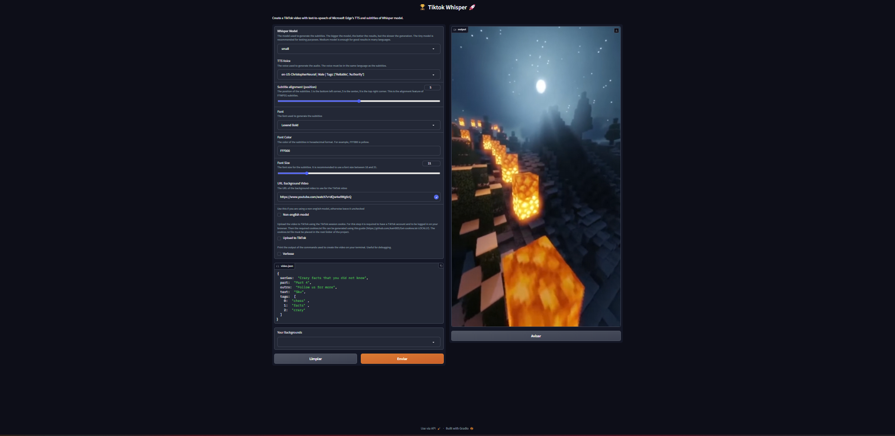

# Introducing Whisper-TikTok 🤖🎥

## Table of Contents

- [Introduction](#introduction)
- [Video (demo)](#demo-video)
- [How it works?](#how-it-works)
- [Web App (Online)](#web-app-online)
- [Streamlit Web App](#streamlit-web-app)
- [Local Installation](#local-installation)
- [Dependencies](#dependencies)
- [Web-UI (Local)](#web-ui-local)
- [Command-Line](#command-line)
- [Usage Examples](#usage-examples)
- [Additional Resources](#additional-resources)
- [Code of Conduct](#code-of-conduct)
- [Contributing](#contributing)
- [Upcoming Features](#upcoming-features)
- [Acknowledgments](#acknowledgments)
- [License](#license)

## Introduction

Discover Whisper-TikTok, an innovative AI-powered tool that leverages the prowess of **Edge TTS**, **OpenAI-Whisper**, and **FFMPEG** to craft captivating TikTok videos. Harnessing the capabilities of OpenAI's Whisper model, Whisper-TikTok effortlessly generates an accurate **transcription** from provided audio files, laying the foundation for the creation of mesmerizing TikTok videos through the utilization of **FFMPEG**. Additionally, the program seamlessly integrates the **Microsoft Edge Cloud Text-to-Speech (TTS) API** to lend a vibrant **voiceover** to the video. Opting for Microsoft Edge Cloud TTS API's voiceover is a deliberate choice, as it delivers a remarkably **natural and authentic** auditory experience, setting it apart from the often monotonous and artificial voiceovers prevalent in numerous TikTok videos.

## Streamlit Web App



## Demo Video

<https://github.com/MatteoFasulo/Whisper-TikTok/assets/74818541/68e25504-c305-4144-bd39-c9acc218c3a4>

## How it Works

Employing Whisper-TikTok is a breeze: simply modify the [video.json](video.json). The JSON file contains the following fields:

- `series`: The name of the series.
- `part`: The part number of the video.
- `text`: The text to be spoken in the video.
- `outro`: The outro text to be spoken in the video.
- `tags`: The tags to be used for the video.

Summarizing the program's functionality:

> Furnished with a structured JSON dataset containing details such as the **series name**, **video part number**, **video text** and **outro text**, the program orchestrates the synthesis of a video incorporating the provided text and outro. Subsequently, the generated video is stored within the designated `output` folder.

<details>
<summary>Details</summary>

The program conducts the **sequence of actions** outlined below:

1. Retrieve **environment variables** from the optional .env file.
2. Validate the presence of **PyTorch** with **CUDA** installation. If the requisite dependencies are **absent**, the **program will use the CPU instead of the GPU**.
3. Download a random video from platforms like YouTube, e.g., a Minecraft parkour gameplay clip.
4. Load the OpenAI Whisper model into memory.
5. Extract the video text from the provided JSON file and initiate a **Text-to-Speech** request to the Microsoft Edge Cloud TTS API, preserving the response as an .mp3 audio file.
6. Utilize the OpenAI Whisper model to generate a detailed **transcription** of the .mp3 file, available in .srt format.
7. Select a **random background** video from the dedicated folder.
8. Integrate the srt file into the chosen video using FFMPEG, creating a final .mp4 output.
9. Upload the video to TikTok using the TikTok session cookie. For this step it is required to have a TikTok account and to be logged in on your browser. Then the required `cookies.txt` file can be generated using [this guide available here](https://github.com/kairi003/Get-cookies.txt-LOCALLY). The `cookies.txt` file must be placed in the root folder of the project.
10. Voila! In a matter of minutes, you've crafted a captivating TikTok video while sipping your favorite coffee ☕️.

</details>

## Web App (Online)

There is a Web App hosted thanks to Streamlit which is public available, just click on the link that will take you directly to the Web App.
> <https://convert.streamlit.app>

## Local Installation

Whisper-TikTok has undergone rigorous testing on Windows 10, Windows 11 and Ubuntu 23.04 systems equipped with **Python versions 3.8, 3.9 and 3.11**.

If you want to run Whisper-TikTok locally, you can clone the repository using the following command:

```bash
git clone https://github.com/MatteoFasulo/Whisper-TikTok.git
```

> However, there is also a Docker image available for Whisper-TikTok which can be used to run the program in a containerized environment.

# Dependencies

To streamline the installation of necessary dependencies, execute the following command within your terminal:

```python
pip install -U -r requirements.txt
```

It also requires the command-line tool [**FFMPEG**](https://ffmpeg.org/) to be installed on your system, which is available from most package managers:

```bash
# on Ubuntu or Debian

sudo apt update && sudo apt install ffmpeg

# on Arch Linux

sudo pacman -S ffmpeg

# on MacOS using Homebrew (<https://brew.sh/>)

brew install ffmpeg

# on Windows using Chocolatey (<https://chocolatey.org/>)

choco install ffmpeg

# on Windows using Scoop (<https://scoop.sh/>)

scoop install ffmpeg
```

>Please note that for optimal performance, it's advisable to have a GPU when using the OpenAI Whisper model for speech recognition. However, the program will work without a GPU, but it will run more slowly. This performance difference is because GPUs efficiently handle fp16 computation, while CPUs use fp32 or fp64 (depending on your machine), which are slower.

## Web-UI (Local)

To run the Web-UI locally, execute the following command within your terminal:

```bash
streamlit run app.py --server.port=8501 --server.address=0.0.0.0
```

## Command-Line

To run the program from the command-line, execute the following command within your terminal:

```bash
python main.py 
```

### CLI Options

Whisper-TikTok supports the following command-line options:

```
python main.py [OPTIONS]

Options:
  --model TEXT              Model to use [tiny|base|small|medium|large] (Default: small)
  --non_english             Use general model, not the English one specifically. (Flag)
  --url TEXT                YouTube URL to download as background video. (Default: <https://www.youtube.com/watch?v=intRX7BRA90>)
  --tts TEXT                Voice to use for TTS (Default: en-US-ChristopherNeural)
  --list-voices             Use `edge-tts --list-voices` to list all voices.
--random_voice              Random voice for TTS (Flag)
  --gender TEXT             Gender of the random TTS voice [Male|Female].
  --language TEXT           Language of the random TTS voice(e.g., en-US)
  --sub_format TEXT         Subtitle format to use [u|i|b] (Default: b) | b (Bold), u (Underline), i (Italic)
  --sub_position INT        Subtitle position to use [1-9] (Default: 5)
  --font TEXT               Font to use for subtitles (Default: Lexend Bold)
  --font_color TEXT         Font color to use for subtitles in HEX format (Default: #FFF000).
  --font_size INT           Font size to use for subtitles (Default: 21)
  --max_characters INT      Maximum number of characters per line (Default: 38)
  --max_words INT           Maximum number of words per segment (Default: 2)
  --upload_tiktok           Upload the video to TikTok (Flag)
  -v, --verbose             Verbose (Flag)
```

> If you use the --random_voice option, please specify both --gender and --language arguments. Also you will need to specify the --non_english argument if you want to use a non-English voice otherwise the program will use the English model. Whisper model will auto-detect the language of the audio file and use the corresponding model.

## Usage Examples

- Generate a TikTok video using a specific TTS model and voice:

```bash
python main.py --model medium --tts en-US-EricNeural
```

- Generate a TikTok video without using the English model:

```bash
python main.py --non_english --tts de-DE-KillianNeural
```

- Use a custom YouTube video as the background video:

```bash
python main.py --url https://www.youtube.com/watch?v=dQw4w9WgXcQ --tts en-US-JennyNeural
```

- Modify the font color of the subtitles:

```
python main.py --sub_format b --font_color #FFF000 --tts en-US-JennyNeural
```

- Generate a TikTok video with a random TTS voice:

```bash
python main.py --random_voice --gender Male --language en-US
```

- List all available voices:

```bash
edge-tts --list-voices
```

## Additional Resources

### Accelerate Video Creation
>
> Contributed by [@duozokker](<https://github.com/duozokker>)

**reddit2json** is a Python script that transforms Reddit post URLs into a JSON file, streamlining the process of creating video.json files. This tool not only converts Reddit links but also offers functionalities such as translating Reddit post content using DeepL and modifying content through custom OpenAI GPT calls.

#### reddit2json: Directly Convert Reddit Links to JSON

reddit2json is designed to process a list of Reddit post URLs, converting them into a JSON format that can be used directly for video creation. This tool enhances the video creation process by providing a faster and more efficient way to generate video.json files.

[Here is the detailed README for reddit2json](https://github.com/duozokker/reddit2json/blob/main/README.md) which includes instructions for installation, setting up the .env file, example calls, and more.

## Code of Conduct

Please review our [Code of Conduct](./CODE_OF_CONDUCT.md) before contributing to Whisper-TikTok.

## Contributing

We welcome contributions from the community! Please see our [Contributing Guidelines](./CONTRIBUTING.md) for more information.

## Upcoming Features 🔮

- Integration with the OpenAI API to generate more advanced responses.
- Generate content by extracting it from reddit <https://github.com/MatteoFasulo/Whisper-TikTok/issues/22>

## Acknowledgments

- We'd like to give a huge thanks to [@rany2](https://www.github.com/rany2) for their [edge-tts](https://github.com/rany2/edge-tts) package, which made it possible to use the Microsoft Edge Cloud TTS API with Whisper-TikTok.
- We also acknowledge the contributions of the Whisper model by [@OpenAI](https://github.com/openai/whisper) for robust speech recognition via large-scale weak supervision
- Also [@jianfch](https://github.com/jianfch/stable-ts) for the stable-ts package, which made it possible to use the OpenAI Whisper model with Whisper-TikTok in a stable manner with font color and subtitle format options.

## License

Whisper-TikTok is licensed under the [Apache License, Version 2.0](https://github.com/MatteoFasulo/Whisper-TikTok/blob/main/LICENSE).
